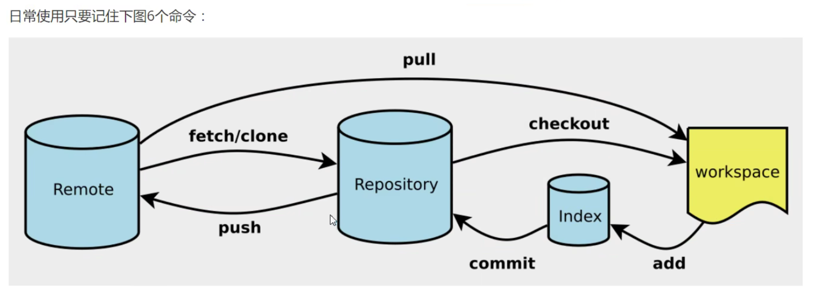
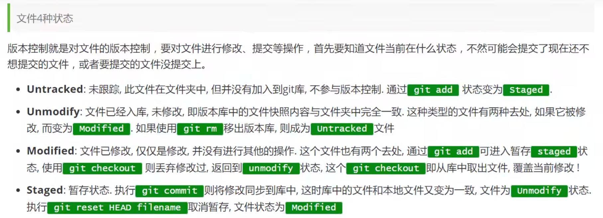
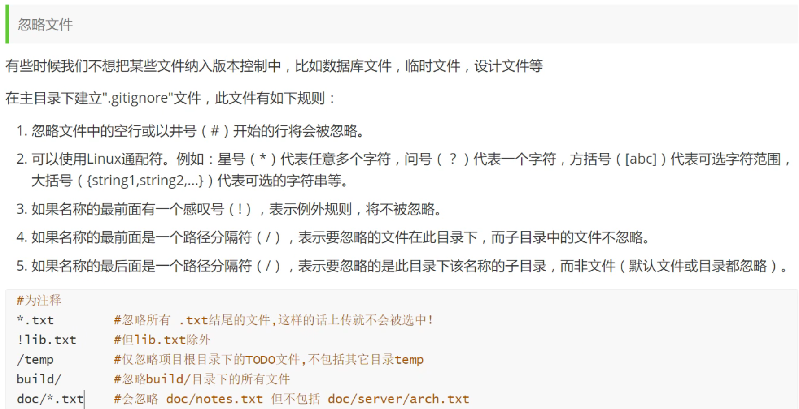
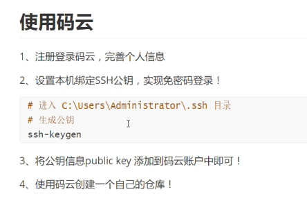
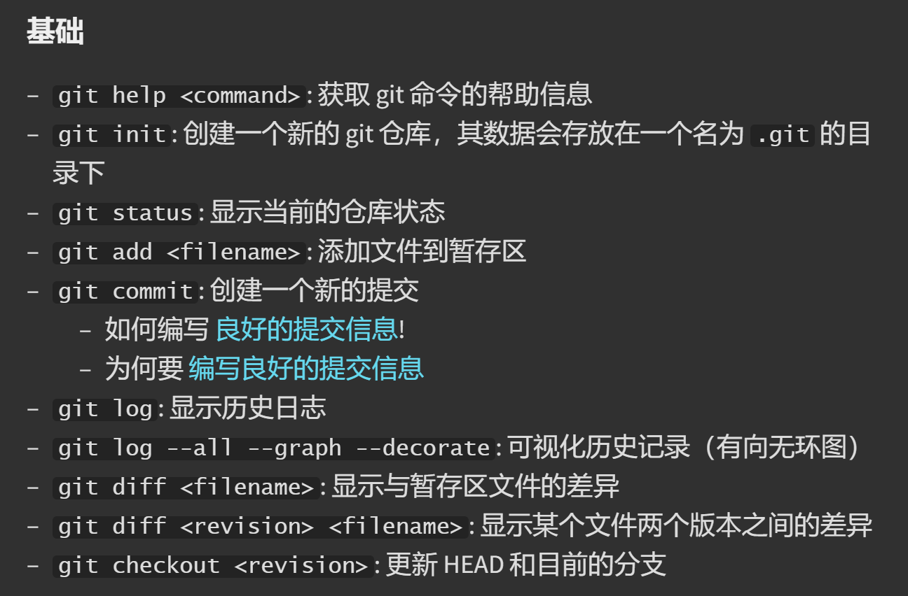
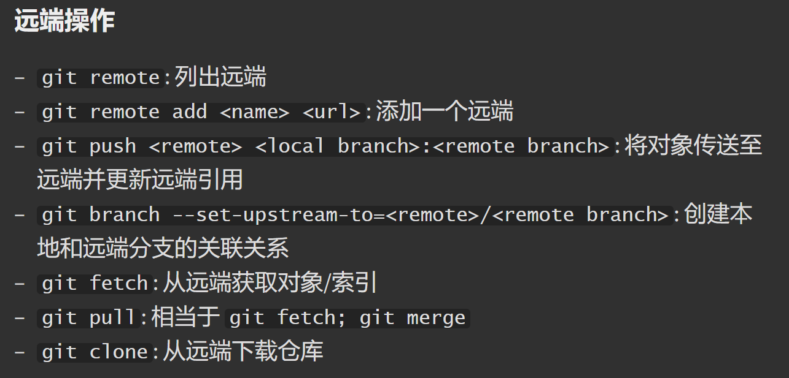
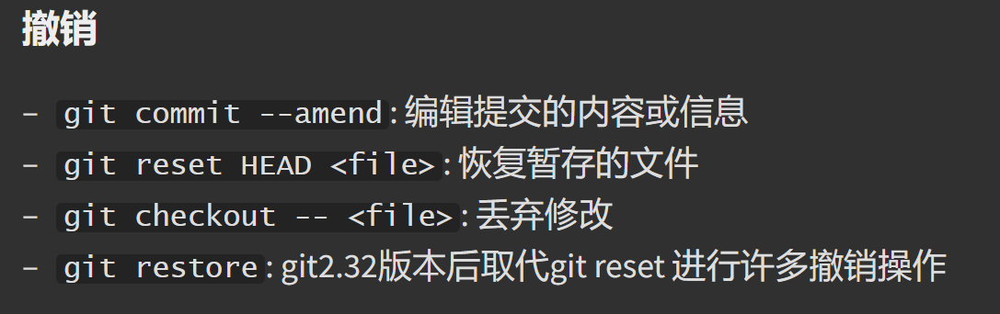
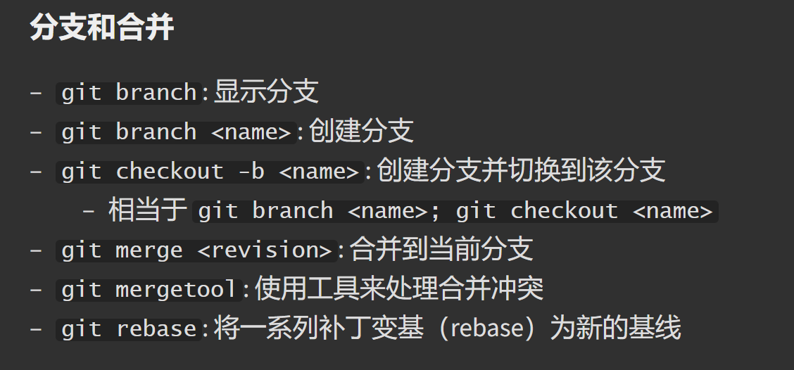

版本控制系统 (VCSs) 是一类用于追踪源代码（或其他文件、文件夹）改动的工具

Git 将顶级目录中的文件和文件夹作为集合，并通过一系列快照来管理其历史记录。在Git的术语里，文件被称作Blob对象（数据对象），也就是一组数据。目录则被称之为“树”，它将名字与 Blob 对象或树对象进行映射（使得目录中可以包含其他目录）。快照则是被追踪的最顶层的树。

Blobs、树和提交都一样，它们都是对象。

版本控制（关联快照）
多人协作管理
本地版本控制(备份不同的版本)
集中管理控制(服务器,多人协作更新)SVN
分布管理控制(每个人都有全部的代码,可能有安全隐患,每个人都有自己的所有备份)Git

SVN 需要联网，有中央服务器
Git 工作时不需要，可以把代码推送给别人

Git Bash Linux代码风格
Git CMD  windows代码风格
Git GUI  图形界面的Git

Git所有的配置文件都保留在本地
#查看系统config
git config --system --list
#查看当前用户(global)配置 
git condig --global --list

Git的相关配置文件
1.Git\etc\gitconfig
Git安装目录下gitconfig --system系统级
2.C:\Users\86181\.gitconfig 
只适用于当前登录用户的配置 --global

配置用户和邮箱（重要）
git config --global user.name "用户名"
git config --global user.email "邮箱地址"

环境变量是为了全局使用

Git 基本理论
三个工作区域:工作目录,暂存区,资源库,(远程git仓库)
working directory | stage(index) | history | remote directory
从左到右：
git add files | git commit | git push
从右到左：
git pull | git reset | git checkout

workspace:工作区，平时存放代码的地方
index:暂存区，用于临时存放改动（一个文件）
repository:仓库区,安全存放数据的位置(head指向最新放入数据的版本)
remote:远程仓库：托管代码的服务器

.git是workshop中的隐藏文件夹

git一般工作流程:
1.在工作目录中添加和修改文件
2.将需要进行版本管理的文件放入暂存区域
3.将暂存区域的文件提交到git仓库

Git项目搭建

创建本地仓库的方法：
1.创建全新的仓库
#在当前目录新建一个git代码库
$ git init
项目目录多了一个.git目录
2.克隆远程目录
#克隆一个项目和他的整个代码历史
$ git clone [url] http://

Git文件操作

#查看文件状态
git status [filename]

#查看所有文件状态
git status

#git add . 添加文件到暂存区
#git commit -m "消息内容"   提交暂存区中的内容到本地仓库
-m 提交信息

忽略文件

使用码云

git命令

